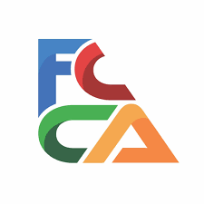
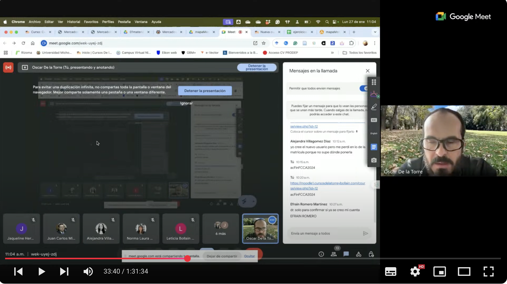

```{r setup, echo=FALSE, warning=FALSE, error=FALSE, message=FALSE}
library(stargazer)
library(plotly)
library(DT)
library(kableExtra)
library(openxlsx)
```

```{r, echo=FALSE, out.width="15%", fig.align="center"}

```

# Introducción

Por medio del presente, se hace el informe del Curso de programación y desarrollo de documentos electrónicos e interactivos en Rstudio para profesores de las ciencias económico-administrativas, el cual se efectuó como un acuerdo de la Academia de Finanzas de la Facultad de Contaduría y Ciencias Adminsitrativas, de la Universidad Michoacana de San Nicolás de Hidalgo.

El objetivo primordial del mismo es proporcionar, a las y los profesores de la FCCA, que impartirán la meteria de Finanzas III en el semestre febrero-agosto de 2025, los conocimientos, materiales y herramientas necesarios para impartir este curso de manera homogénea en todas las secciones de la misma.

# Fechas py duración del curso del curso impartido

- **Fechas:** Del 27 al 31 de enero del 2025 de 10:00 a 12:00 (en línea vía [plataforma Moodle Dr. Oscar De la Torre](https://moodle1.cursosdelatorreybollain.com/course/view.php?id=12)])    .
- **Duración:** 40 horas, impartidas en 5 días de sesiones de 4 horas (2 horas teóricas y 2 horas prácticas).

# Presentación y objetivo del curso impartido

El presente curso está orientado a profesores y personal Académico que impartirá la materia de Finanzas III en el semestre **febrero-agosto de 2025** en la Facultad de Contaduría y Ciencias Administrativas. Este curso cuenta con el aval del H. Consejo Técnico de la FCCA y es requisito solicitado por la Academia de Finanzas de dicha dependencia, a efecto de homologar el temario e impartición de la materia en todas las secciones de la misma.

El objetivo temático del mismo es introducir a las y los estudiantes de la Licenciatura en Contaduría en el mundo de los mercados financieros, el ana´lisis y toma de decisiones de inversión, así como la gestión de portafolios. Esto desde la perspectiva de una (un) inversionista privado y uno institucional.

# Temario impartido

El temario que se cubrió fue el siguiente:

```{r temarioT, echo=FALSE, error=FALSE, message=FALSE, warning=FALSE}

temario=data.frame(Tema=c("1. Introducción al tema","2. Tipos de administración de inversiones","3. Microectructura de los mercados de valores y operaciones en los mismos","4. El proceso de administración de inversione","5. Otros mercadofinancieros que no son valores"),
                   Fecha=c("27 de enero de 2025","28 de enero de 2025","29 de enero de 2025","30 de enero de 2025","31 de enero de 2025"),
                   Horario=c("10:00-12:00 teórico + 2 horas de trabajos",
                             "10:00-12:00 teórico + 2 horas de trabajos",
                             "10:00-12:00 teórico + 2 horas de trabajos",
                             "10:00-12:00 teórico + 2 horas de trabajos",
                             "10:00-12:00 teórico + 2 horas de trabajos"),
                   Objetivo=c("Introducir a las y los estudiantes al mundo de los mercados financieros, el análisis y toma de decisiones de inversión, así como la gestión de portafolios. Esto desde la perspectiva de una (un) inversionista privado y uno institucional.",
                              "Conocer los tipos de administración de inversiones que existen, así como sus características principales.",
                              "Conocer la microestructura de los mercados de valores y las operaciones que se realizan en los mismos.",
                              "Conocer el proceso de administración de inversiones, así como las etapas del mismo.",
                              "Conocer otros mercados financieros que no son valores, así como sus características principales.")
)

kable(temario) 
```

**El curso tiene un total de 40 horas (20 teóricas y 20 prácticas).**

La siguiente imagen muestra un mapa mental del temario del curso:

```{r, echo=FALSE, out.width="100%", out.height="90%", fig.align="center"}
knitr::include_graphics("programaFinanzas3.pdf")
```

# Lista de personas probadas y tituladas del curso, así como evidencia de su ejecución

La siguiente tabla relaciona la lista de profesoras y profesores que acudieron al curso, cumplieron con los requisitos de calificación y asistencia y aprobaron el curso. a esta lista es a la que se les deberá elaborar la constancia de participación.

```{r}
asistencia=read.xlsx("tables/asistencia2025.xlsx")
kable(asistencia) 
```


## Evidencia de su impartición

El curso se impartió en línea y la evidencia de las clases impartidas puede encontrarse en la siguiente URL:

[https://studio.youtube.com/playlist/PLJ5J1IP28_K57l8DVOiesZvFgJMD8LQFn/edit](https://studio.youtube.com/playlist/PLJ5J1IP28_K57l8DVOiesZvFgJMD8LQFn/edit)




## Para comprobación para beca al desempeño ESDEPED

Adicional a la constancia proporcionada por la FCCA, la o el sustentane podrá descargar el presente programa en la opción "otros formatos" a la derecha, en la tabla de contenidos de este informe en línea (página web).

# Contacto

Cualquier necesidad o problema técnico, favor de comunicarse en la página de contacto de mi sitio web: [https://www.oscardelatorretorres.com/contacto](https://www.oscardelatorretorres.com/contacto)