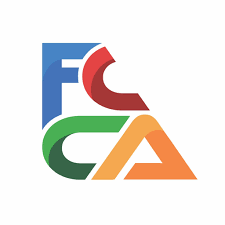

```{r setup, echo=FALSE, warning=FALSE, error=FALSE, message=FALSE}
library(stargazer)
library(plotly)
library(Quandl)
library(siebanxicor)
library(stargazer)
library(flextable)
library(officer)
library(openxlsx)
```

```{r, echo=FALSE, out.width="15%", fig.align="center"}

```

# Fechas del curso

 Del 1 al 12 de julio del 2024 de 10:00 a 12:00 (en plataforma Moodle: [https://137.184.4.236/](https://137.184.4.236/))    .

# Instrucciones para el registro

1. Favor de inscribirse en la [plataforma Moodle del Dr. Oscar De la Torre Torres](https://137.184.4.236/) en la materia **Curso de diseño y publicación de documentos web, notas interactivas y resultados de investigación empleando Rstudio y GitHub (2024)**:   [https://137.184.4.236/](https://137.184.4.236/)
2. Cree un usuario y password nuevo en la sección **Registrarse como usuario**.
3. Espere el correo de confirmación de creación de cuenta (puede revisar en el *spam* o correo no deseado).
4. En el correo de confirmación de creación de cuenta, haga clic en el enlace de confirmación.
5. Se le remitirá a una página del curso en donde deberá introducir (por única ocasión) la siguiente clave de matriculación: **FCCA2024a**

¡Listo! ya está inscrit@ en el curso.

Si tiene problemas técnicos puede conectarse, el primer día del curso en esta liga permanente de Google meet en la que se llevarán todas las sesiones de clase:
[https://meet.google.com/sei-azay-rho](https://meet.google.com/sei-azay-rho)

Si desea una explicación más detallada de cómo registrarse en la plataforma Moodle, favor de ver el siguiente video:

<iframe width="560" height="315" src="https://www.youtube.com/embed/6uaow6eXjVA?si=WxUoX57VZNbU0uFB" title="YouTube video player" frameborder="0" allow="accelerometer; autoplay; clipboard-write; encrypted-media; gyroscope; picture-in-picture; web-share" referrerpolicy="strict-origin-when-cross-origin" allowfullscreen></iframe>

Le espero gustosamente en clase...

Dr. Oscar V. De la Torre Torres

# Contacto

Cualquier necesidad o problema técnico, favor de comunicarse en la página de contacto de mi sitio web: [https://www.oscardelatorretorres.com/contacto](https://www.oscardelatorretorres.com/contacto)